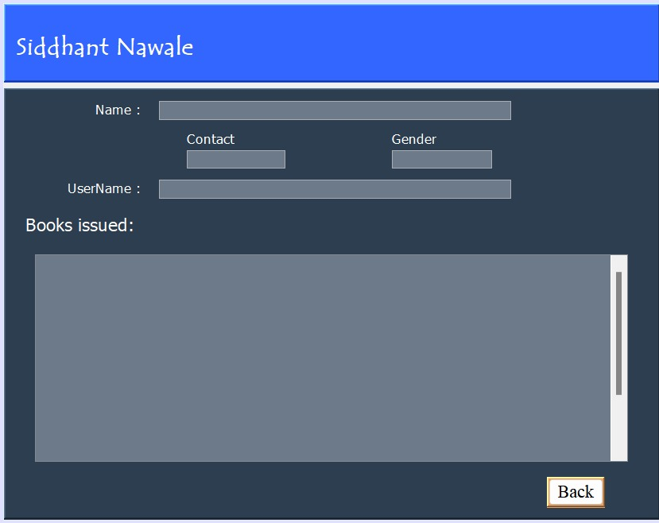
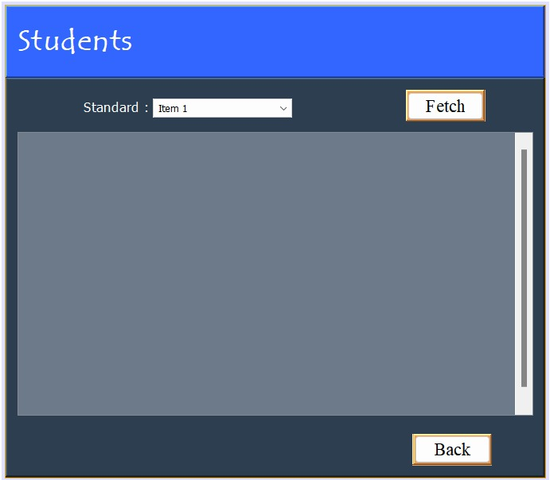
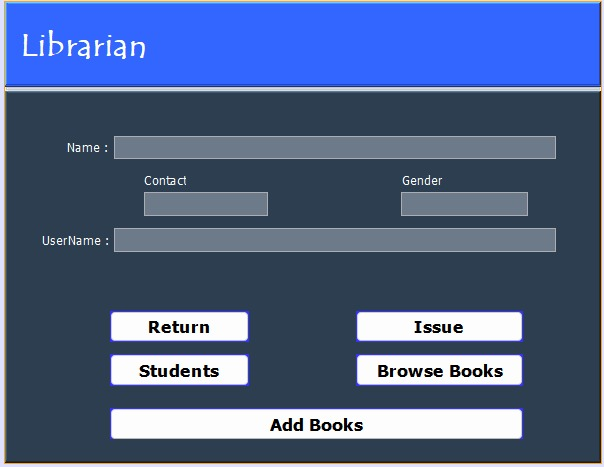
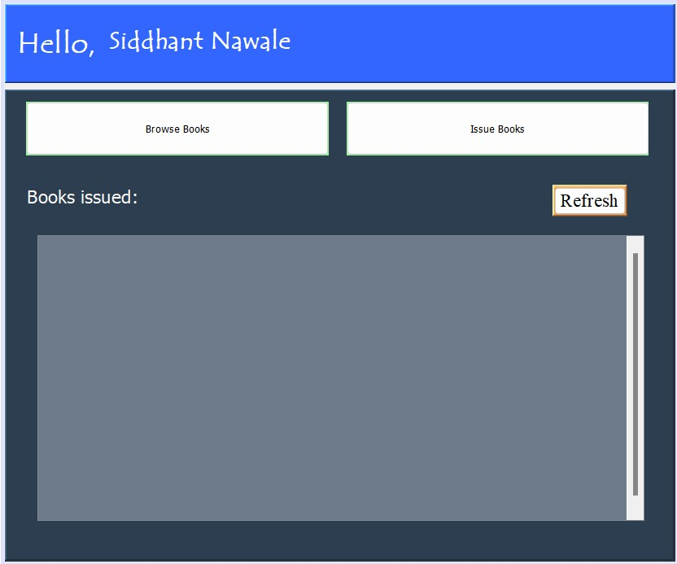

# Library-Management
## Description

Developed using Apache NetBeans, this project streamlines library operations with an intuitive interface. Efficiently manage book cataloging, member records, and lending processes, empowering librarians with a user-friendly tool for organized library administration.

## Images

### Student Homepage
#### 

### Browse Books Page
#### 

### Librarian Homepage
#### 

### Librarian Issue Page
#### 
